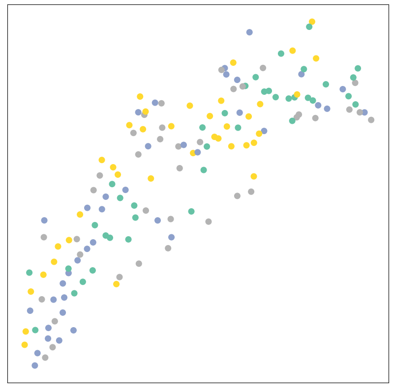

# Lab 7 Graph ML Project
## Author: Nigel Nelson
## Date: 2/11/2023

---

## Abstract
This project aimed at predicting directional intent using "Inner Speech" EEG signals. Predicting directional intent using EEG signals would allow for a new generation of BCIs that would enable the physically disabled to interact with computers using only their thoughts. This work sought to prove two related hypotheses. The first is that modeling EEG data as a graph structure where nearby channels are connected by edges would enable more accurate predictions when compared to traditional CNNs using tabular data. The second hypothesis was that using this graphical EEG format, a spatial-temporal graph convolutional network would predict with the highest degree of accuracy, followed by a graph attention network, and the worst performing architecture would be a graph convolutional network. Through the experiments in this work, it was determined that modeling inner voice EEG data in a graphical format was more efficacious than the standard tabular modeling, as all three graph networks achieved at least 33.00% accuracy, surpassing the state-of-the-art CNN models on this data set. Additionally, it was determined that the spatial-temporal graph convolutional network did perform the best with an accuracy of 34.00%, however, both the graph attention network and the graph convolutional network achieved 33.00%, indicating there was no clear performance benefit between the two models.

## Introduction
This work sought to predict directional intent through the use of "Inner Speech" EEG signals. Inner speech is defined as conscious thoughts in a coherent, linguistic form. Inner speech is also known as verbal thinking, internal monologue, internal dialogue, covert self-talk, and more [4]. EEG is the most common method of recording this inner speech [5]. The purpose of this work is to use Graph Machine Learning concepts to interpret the EEG data sets of inner speech, with the ultimate goal of advancing the field of brain-computer interfaces (BCIs). BCIs offer a connection for individuals with motor disabilities to interact with the outer world using only their thoughts [5]. Currently, BCIs rely on steady-state visual evoked patterns, such as staring at a virtual keyboard's up arrow until it is selected. However, the hope is that inner speech data sets will lead to more intuitive AI models for BCIs where users can simply think of their desired actions and the computer will execute them [1]. Yet, the current state-of-the-art for predicting inner speech from EEG is limited with accuracy rates just above 80%, which are only achieved in simple, binary problems involving short words [5].

Recently, novel data sets have been generated for this particular classification problem, including the "Thinking out loud" data set that is concerned with directional intent [1]. This data was gathered by placing a 136-channel EEG head cap on subjects while they used inner speech to express directional intent, with each channel sampled at 1024 Hz [1]. The data set included 10 participants, who were each asked to complete a set number of trials for each of the 4 directional categories: "up," "down," "left," and "right" [1]. This resulted in an inner speech data set with 559 trials for each direction, with each trial lasting 4.5 seconds, creating a data set of 18.29 Gb in size [1].

Soon after the publication of the data set, B. v. d. Berg et al [3] released a research paper on their ability to decode it using a Convolutional Neural Network (CNN). The researchers utilized the EEGNet architecture for their CNN due to its small size and limited number of parameters, which reduce the risk of overfitting compared to deeper networks [3]. They selected a subset of 28 channels out of the 136, specifically those focused on the left hemisphere of the brain where the regions responsible for inner voice are located [3]. The preprocessing used by the researchers involved the preprocessing offered by the data set's publishers, including a broad filter from 0.5-100 Hz, a notch filter at 50 Hz, Independent Component Analysis (ICA), and down-sampling to 256 Hz [3]. Afterward, the data was subjected to standard scaling and fed into the publicly available EEGNet implementation [3]. To evaluate the effectiveness of their training, the researchers employed K-fold evaluation with 4 folds, using subject-dependent evaluation. This involves training a single model on data from a single subject [3]. The result of this training showed an average accuracy, precision, recall, and F1 score across 8 subjects of 29.67%, 29.76%, 29.68%, and 29.67% respectively. This performance, for a 4-class classification problem, is slightly above random chance.

While no graph machine learning techniques have been applied in the inner voice domain, Graph convolutional networks have been applied successfully in a similar discipline: sleep stage classification [6]. Li et al. applied an attention-guided spatiotemporal graph convolution network to the sleep-EDF data set, which is a data set comprised of 197 full nights of EEG data annotated with the sleep stages at every 30-second interval. The authors adapted one of the pioneering works in the spatiotemporal GNN domain, the ST-GCN published by Yan et al. [7]. Li et al. used an adaptation of this work, where 9 ST-GCN modules were used, but each module was separated from another using an attention block. These ST-GCN modules consisted of two components: a graph convolutional layer (GCN) and a temporal convolutional layer (TCN). The graph convolutional layers modeled the data as a graph, where each node in the graph represented a single electrode from the EEG cap used to collect the data, and the features of the node are the associated channel in the EEG data. The GCN layers are then used to learn the spatial information of these channels, by learning the relationships between the various channels of EEG input. After the spatial information is captured in an ST-GCN module, next a TCN is applied to learn the temporal information. This TCN is a 1D convolution done across the temporal dimension, such that convolutional kernels are learned that extract temporal features from each of the EEG channels. After this ST-GCN module, the output is fed into an attention block, which learns which sections of the output should be paid close attention to, and forwards this learned attention and the spatiotemporal features to the next ST-GCN module where this process is repeated. After the final module, global max pooling is used to aggregate all of the information extracted and allows the network to make a graph-level prediction for the entirety of the data fed into the model [7]. Using this architecture outlined, Li et al. were able to achieve 91.00% average accuracy on the Sleep-EDF data set, surpassing all previous benchmarks set by GCN-based methods and non-GCN-based methods.

## Methods:
### Data Set & Preprocessing:
This work’s data set of choice is the publicly available “Thinking out Loud” data set which is described
in [1]. In addition, the publishers of the data set created a repository with implementations of the pre-processing techniques they believed to be optimal. B. v. d. Berg Et Al. achieved an average accuracy of 29.67% [3] using these techniques, so this work also opted to use these previously successful preprocessing steps.

Before the data was used in analysis, several preprocessing steps were taken to clean and prepare the EEG signals. Firstly, a broad filter was applied that removed all EEG signals outside the frequency range of 0.5-100 Hz. This was done to preserve all brain activity and eliminate any outside signals that were not related to brain activity. The lower boundary of 0.5 Hz corresponds to delta waves and the upper boundary of 100 Hz to gamma ranges [8].
Next, a notch filter was applied to remove the 50 Hz frequency. The reason for this is that this data set was collected in Europe, where power lines use alternating current with a frequency of 50 Hz [1]. As such, the extremely sensitive EEG electrodes can pick up on this noise if not removed [1]. The data was then down-sampled to a final sampling rate of 256 Hz. Independent Component Analysis (ICA) was also applied to the data set. ICA is a technique that works on the principle of separating statistically independent and non-gaussian components of the data. The technique maximizes the non-gaussian nature of each component and removes noise identifiable with control channels that monitored external noise, such as eye and mouth movements. Finally, all data outside the recording range of 1-3.5 seconds was removed as this was the only range in which the subjects were using their inner voice to convey directional intent.
With these preprocessing steps completed, the next step was to convert this tabular data into a graph representation. To do this, the Pytorch-Geometric library was used to model the relational structure of this data. The nodes of this graph data were represented by each of the EEG channels of input, resulting in 128 nodes in a single graph of EEG data. Each of these nodes had its associated channels of signals, where after down-sampling to 256 Hz and using 2 seconds of recording, each node had 512 features representing 2 seconds of EEG data. Finally, to model the relational structure of these channels, edges were used to connect channels that neighbored one another. This was done in an undirected manner, such that each node was connected by out-going and in-coming edges to all neighboring nodes. The graphical nature of this data is visualized in Figure 1.

<b>Figure 1:</b> Visualization of how the EEG data was converted from tabular to a graph structure. Each electrode represents a node which has a channel of input and each red line represents an edge between node

### Experiments:
#### Overview:
All experiments conducted by this work are implemented in Python 3.6.10, and utilize the Pytorch (20.07) and Pytorch-Geometric (2.0.3) libraries. Evaluation of these models is done in a subject-dependent way, where each model in trained on the data from a single subject and evaluated on a test set from that same subject. Due to the time restraints of this project, this is done exclusively for subject 1 from the Inner Voice data set. To ensure an accurate comparison to B. v. d. Berg Et al., K-fold evaluation was used to evaluate all models using 4 folds. Additionally, all models were trained and evaluated on a single NVIDIA Tesla V100.
#### Experiment 1 – GCN Testing
To establish a baseline model, a simple GCN was created and evaluated on the Inner Voice data set. This experiment was conducted to determine the efficacy of using a “static” GCN, which does not include any special features to capture dynamic, temporal information. This created a baseline GCN, and allowed several sub-experiments to be run to determine the optimal hyperparameters. Sub-experiments were run to determine the optimal number of GCN layers, the optimal dropout rate, and the optimal number of hidden dimensions to use for these GCN layers. The number of GCN layers was varied from 1-8 layers, in order to determine the most effective number of GCN layers. Once the optimal number of layers was established, dropout layers were appended between these GCN layers, and dropout rates of 0, .3, and .5 were tested to determine the optimal dropout rate. Finally, the number of hidden dimensions in these GCN layers was tested at 64, 128, 256, and 512 to determine which is most efficacious.
#### Experiment 2 – GAT Testing:
Due to the fact that attention mechanisms were a major component of the successful architecture used by Li et al. [6], the second experiment focuses on mirroring the experiments run in experiment #1, but replaces the GCN layers with Graph Attention Network Layers (GAT). To implement this, the *GATv2Conv* layer was used from the Pytorch-Geometric library as opposed to the original *GATConv* layer. The reason for this is Brody et al. [8] explains that traditional GATs only compute static attention, where attention is calculated using a fixed initial representation of nodes. This is an issue as nodes are dynamic and change during the computation process. To remedy this, Brody et al. introduce the *GATv2Conv* layer which computes dynamic attention. So, the first experiment varied the number of *GATv2Conv* layers and evaluated using 3-8 GAT layers. Once the optimal number of layers was established, dropout layers were appended between these GAT layers, and dropout rates of 0, .3, and .5 were tested to determine the optimal dropout rate. Also, the number of hidden dimensions in these GAT layers was tested at 64, 128, 256, and 512 to determine which was most efficacious. Lastly, the number of attention heads was varied for all layers between 8, 4, 2, and 1 to determine the optimal configuration for these GAT layers.

#### Experiment 3 – ST-GCN Testing:

While graph machine-learning techniques are excellent for capturing spatial relationships, they lack any specialized mechanisms to decode temporal dependencies. As such, this work tested the benefit of using spatiotemporal convolutional blocks. Specifically, the *STConv* layer was implemented in Pytorch from the description in [7]. Each layer applied a graph convolution, followed by temporal convolution across the time domain, and combines this output with the residual input value. First, a baseline model was established using 4 STConv layers. Following this, the temporal convolutional kernel size was tested with the sizes 1,5,7,13,17,21,25, and 29. Once the optimal kernel size was established, the number of layers was tested, using between 3-8 STConv layers. Finally, dropout was tested with dropout rates of 0, 0.3, and 0.5.

## Results:
#### Experiment 1 – GCN Testing
The first experiment focused on using a Graph Convolutional Network to decode the Inner Voice [1] data set. This work was broken into several sub-experiments to optimize a GCN for this EEG data set. The first sub-experiment was testing the number of GCN layers to determine the optimal size network. The results from this experiment are summarized in Table 1.

<b> Table 1 </b>

| # of GCN Layers | Average Accuracy |
|-----------------|------------------|
| 1               | 30.00            |
| 2               | 30.00            |
| 3               | 25.00            |
| 4               | 28.00            |
| 5               | 29.00            |
| 6               | 32.00            |
| 7               | 31.00            |
| 8               | 33.00            |

By viewing Table 1, it is clear that using 8 GCN layers results in the best average accuracy, achieving 33.00% accuracy. However, the table does show that there is not a clear linear relationship, where it cannot be said that generally, as you increase the number of GCN layers the accuracy increases as well. The reason for this is that using only 1 or 2 GCN layers resulted in a 30.00% accuracy, the 3rd best accuracy achieved. Subsequent testing is needed to determine the true relationship underlying the number of layers and accuracy. However, this work accepted that 8 layers yielded the greatest accuracy, so it was decided to use this configuration for subsequent tests.

The second sub-experiment tested various sizes for the hidden layer. Using the 8-layer GCN, hidden layer dimensions of 64, 128, 256, and 512 were tested to determine the optimal size. The results from this testing can be seen in Table 2.

<b> Table 2 </b>

| Hidden Layer Size | Average Accuracy |
|-------------------|------------------|
| 64                | 29.00            |
| 128               | 27.00            |
| 256               | 33.00            |
| 512               | 30.00            |

From this table, it can be observed that using a hidden layer size of 256 led to the greatest accuracy. Again, it can also be observed that there is not a clear, linear relationship between the hidden layer size and the resulting accuracy. Yet, it was accepted that 256 produced the greatest accuracy, so this was the size used in subsequent testing.

The final sub-experiment conducted was to test the optimal dropout rate for the GCN. To test this, dropout layers were added to the network after the 3rd, 5th, and 7th convolutional layers. Dropout rates of 0.0, 0.3, and 0.5 were evaluated, and these results are summarized in Table 3.

<b> Table 3 </b>

| Dropout Rate | Average Accuracy |
|--------------|------------------|
| 0.0          | 33.00            |
| 0.3          | 33.00            |
| 0.5          | 33.00            |

The results from Table 3 are somewhat surprising, where it was observed that there was not a change in accuracy for any of the dropout rates. This is concerning as having up to 50% of weights negated to zero should have a measurable impact on the model's accuracy. However, after re-analyzing the code no obvious mistakes were made, so it was accepted that dropout simply did not have an impact on the accuracy of the model.

<b>Figure 2:</b> Loss and Accuracy plots for optimized GCN, using 8 GCN layers, 256 dimensions in the hidden layers, and a dropout rate of 0.0.

<b>Figure 3:</b> TSNE visualization of the EEG embeddings created by the optimized GCN, using 8 GCN layers, 256 dimensions in the hidden layers, and a dropout rate of 0.0.

#### Experiment 2 – GAT Testing
Due to the reported importance of attention in the success of [6], Graph Attention Networks were the next focus of this work. The first experiment tested the optimal number of GAT layers, ranging from 3-8 layers. The results from this experiment can be seen in Table 4.

<b> Table 4 </b>

| # of Layers | Average Accuracy |
|-------------|------------------|
| 3           | 31.00            |
| 4           | 33.00            |
| 5           | 28.00            |
| 6           | 26.00            |
| 7           | 32.00            |
| 8           | 33.00            |

By viewing Table 4, it can be observed that 4 & 8 layers both achieved an accuracy of 33.00%, matching the best accuracy from the GCN experiments. Again, due to the limited number of trials, no distinct relationship is seen between the number of layers and the average accuracy produced. It is apparent that more experiments are needed to determine this relationship. However, 8 layers was chosen as the number of layers to conduct the following experiments with as it achieved the highest accuracy score, and will also provide a more meaningful comparison to the 8-layer GCN created in Experiment #1.
Following this, the next experiment sought to determine the optimal number of hidden layers for the GAT network. Sizes of 64, 128, 256, and 512 were used to determine the correct size of the network. The results from these tests can be seen in Table 5.

<b> Table 5 </b>

| Hidden Layer Size | Average Accuracy |
|-------------------|------------------|
| 64                | 32.00            |
| 128               | 31.00            |
| 256               | 33.00            |
| 512               | 28.00            |

From the results in Table 5, it can be observed that the highest-performing hidden dimension size was 256, mirroring the results from the GCN experiments. As such, for subsequent tests, the hidden layer size was set to 256 to optimize results.

The third sub-experiment for the GAT network was testing various dropout rates. Dropout rates of 0.0, 0.3, and 0.5 were tested, and these results are summarized in Table 6.

<b> Table 6 </b>

| Dropout Rate | Average Accuracy |
|--------------|------------------|
| 0.0          | 33.00            |
| 0.3          | 33.00            |
| 0.5          | 33.00            |

Similar to the results in the GCN experiment, Table 6 shows no difference between any of the dropout rates. While this was an unexpected result, this further validated that dropout may not be a key component when attempting to decode the Inner voice data set, as the GAT’s dropout rate had a different implementation. In the GCN experiment, dropout layers had to be manually appended to the network, however, the GAT layer provided an argument that implemented dropout within the layer. Thus, with two separate implementations and a similar result, it was concluded that dropout does not have a noticeable effect on the noisy Inner Voice data set.
The final experiment of the GAT network focused on determining the optimal number of attention heads. In this experiment, 1,2,4, and 8 attention heads were used to determine the optimal parameter to use for subsequent work. The results from this experiment are summarized in Table 7.

<b> Table 7 </b>

| # Attention Heads | Average Accuracy |
|-------------------|------------------|
| 1                 | 28.00            |
| 2                 | 32.00            |
| 4                 | 31.00            |
| 8                 | 33.00            |

These results indicate that a single attention head fails to capture the amount of information that seemed to benefit GAT’s with more attention heads. Ultimately, 8 attention heads achieved the best average accuracy, resulting in the final GAT network achieving 33.00% average accuracy when all parameters discovered to be optimal were used.

<b>Figure 4:</b> Loss and Accuracy plots for optimized GAT, using 8 GAT layers, 8 attention heads in each layer, 256 dimensions in the hidden layers, and a dropout rate of 0.0.

<b>Figure 5:</b> TSNE visualization of the EEG embeddings created by the optimized GAT, using 8 GAT layers, 8 attention heads in each layer, 256 dimensions in the hidden layers, and a dropout rate of 0.0.

#### Experiment 3 – Spatial-Temporal Testing:
The final experiment sought to determine the efficacy of spatiotemporal Graph networks due to previous success using these networks within the EEG classification domain [6]. The first experiment sought to determine the optimal size for the kernel used in the 1D temporal convolution. Kernel sizes 1,5,7,13,17,21,25, and 27 were used, and the results from these tests can be seen in Table 8.

<b> Table 8 </b>

| Temporal Kernel Size | Average Accuracy |
|----------------------|------------------|
| 1                    | 30.00            |
| 5                    | 34.00            |
| 7                    | 32.00            |
| 13                   | 29.00            |
| 17                   | 30.00            |
| 21                   | 32.00            |
| 25                   | 31.00            |
| 27                   | 27.00            |

By viewing Table 8, it can be seen that the best accuracy achieved was 34.00%, which was achieved using a temporal convolutional kernel 5 samples in length. This was the best accuracy achieved by this work yet, so this kernel size was used in all subsequent experiments.
The next experiment conducted varied the level of dropout used within this spatial-temporal architecture. As with previous experiments, dropout rates of 0.0, 0.3, and 0.5 were used to determine which offered the greatest accuracy. The results from this experiment are summarized in Table 9.

<b> Table 9 </b>

| Dropout Rate | Average Accuracy |
|--------------|------------------|
| 0.0          | 34.00            |
| 0.3          | 34.00            |
| 0.5          | 34.00            |

Again, it can be observed that no noticeable effect was seen for any of the dropout rates. This further supports the hypothesis that dropout rate is not a meaningful hyperparameter for the Inner Voice data set.

The final experiment sought to determine the optimal number of layers to use in the spatiotemporal classification network. The number of layers varied between 3-8 layers and the results from these tests can be seen in Table 10.

<b> Table 10 </b>
| # of Layers | Average Accuracy |
|-------------|------------------|
| 3           | 30.00            |
| 4           | 34.00            |
| 5           | 24.00            |
| 6           | 29.00            |
| 7           | 34.00            |
| 8           | 31.00            |

By viewing Table 10, it can be seen that the best accuracy achieved was 34.00%, which was achieved using 6 spatiotemporal convolutional layers. Similar to earlier tests, no distinct relationship can be seen between the number of layers used and the resulting accuracy. Both the 4-layer and the 7-layer configurations achieved accuracies of 34.00%, but following the principle of Occam’s Razor, the 4-layer configuration was selected as the preferred architecture.

<b>Figure 6:</b> Loss and Accuracy plots for optimized ST-GCN, using 4 ST-GCN layers, 512 dimensions in the hidden layers, and a dropout rate of 0.0.

<b>Figure 7:</b> TSNE visualization of the EEG embeddings created by the optimized ST-GCN, using 4 ST-GCN layers, 512 dimensions in the hidden layers, and a dropout rate of 0.0

## Discussion: 
Several experiments were run testing various hyperparameter configurations using GCNs, GATs, and ST-GCNs. One noticeable feature of all of these tests was that all failed to portray a clear relationship between the hyperparameters and the resulting accuracy. The likely reason for this is the difficulty of the underlying data set. The state-of-the-art on this data set is the EEGNeet architecture trained by B.v.d. Berge et al. [3]. This model achieved an average accuracy of 29.67% when evaluated in a subject-dependent manner across 8 subjects. More specific to this work, B.v.d. Berge et al. achieved an accuracy of 30.00% on subject 1. This is just slightly more accurate than a random chance for a 4-class classification problem. With this being the current SOTA, this indicates the difficulty of this data set. As such, this likely explains the results of this work's experiments that appeared to have almost random results. While true optimal parameters may have been found, it is likely that the results may have just been a result of chance. This theory is further validated by the loss charts seen in Figures 2, 4, and 6. These charts do not show an obvious sign of learning, instead, there are sharp peaks and valleys for each epoch. This indicates that from epoch to epoch, the model updates its parameters and either gets lucky with this guess or guesses incorrectly and predicts below a random chance guess. Additionally, this randomness can be seen in greater detail in Figures 3, 5, and 7, which visualize the embedding produced by the models. It can be clearly seen that all 4 classes are thoroughly mixed within this embedding space, indicating that any correct predictions are more likely attributed to chance than the modeling learning defining features of the 4 classes.

## Conclusion
This work set out to prove two hypotheses. The first was that modeling EEG data as a graph structure that connects neighboring EEG channels would allow for greater predictive capability when compared to conventional CNN approaches. Secondly, this work hypothesized that within the graph machine learning domain, the best-performing architecture would be a spatiotemporal convolutional network, followed by a graph attention network, and the least performant model would be a graph convolutional network. These hypotheses were tested by running several experiments for each graph architecture, varying hyperparameters such as the number of network layers, the dropout rate, the number of hidden dimensions, kernel sizes, and the number of attention heads. The results of this hyperparameter testing were 3 separate models with optimized hyperparameters for the Inner Voice classification task. A GCN was created with 8 layers, 256 dimensions in the hidden layers, and a dropout rate of 0.0 that achieved an average accuracy of 33.00% on subject 1’s EEG data. A GAT network was created that had 8 layers, 8 attention heads in each layer, 256 dimensions in the hidden layers, and a dropout rate of 0.0 that achieved an average accuracy of 33.00% on subject 1’s EEG data. Lastly, an ST-GCN was produced that had a temporal kernel of size 5, 4 network layers, 512 dimensions in the hidden layers, and a dropout rate of 0.0 that achieved an average accuracy of 34.00%.
As such, with the state-of-the-art CNN achieving 30.00% average accuracy [3], this work was able to indicate that on subject 1’s data, modeling the EEG data in a graph structure appeared to offer performance benefits as all graph networks were able to achieve superior accuracies. However, this work was unable to verify its second hypothesis that the ST-GCN would offer the greatest accuracy, followed by the GAT network, with the GCN achieving the worst accuracy. Instead, it was found that the ST-GCN achieved the greatest accuracy of 34.00%, however, the GAT network and the GCN both achieved an accuracy of 33.00%, failing to indicate which network offered the predictive edge.

## References:
1.  Nieto, N., Peterson, V., Rufiner, H.L. et al. Thinking out loud, an open-access EEG-based BCI dataset for inner speech recognition. Sci Data 9, 52 (2022). https://doi.org/10.1038/s41597-022-01147-2
2.  Nicolas Nieto and Victoria Peterson and Hugo Rufiner and Juan Kamienkowski and Ruben Spies (2022). Inner Speech. OpenNeuro. [Dataset] doi: doi:10.18112/openneuro.ds003626.v2.1.2
3.  B. v. d. Berg, S. v. Donkelaar and M. Alimardani, "Inner Speech Classification using EEG Signals: A Deep Learning Approach," 2021 IEEE 2nd International Conference on Human-Machine Systems (ICHMS), 2021, pp. 1-4, doi: 10.1109/ICHMS53169.2021.9582457.
4.  Alderson-Day, Ben, and Charles Fernyhough. “Inner Speech: Development, Cognitive Functions, Phenomenology, and Neurobiology.” Psychological bulletin vol. 141,5 (2015): 931-65. doi:10.1037/bul0000021
5.  Lopez-Bernal, Diego et al. “A State-of-the-Art Review of EEG-Based Imagined Speech Decoding.” Frontiers in human neuroscience vol. 16 867281. 26 Apr. 2022, doi:10.3389/fnhum.2022.867281
6. Li, Menglei, Hongbo Chen, and Zixue Cheng. "An attention-guided spatiotemporal graph convolutional network for sleep stage classification." Life 12.5 (2022): 622.
7. Yan, Sijie, Yuanjun Xiong, and Dahua Lin. "Spatial temporal graph convolutional networks for skeleton-based action recognition." Thirty-second AAAI conference on artificial intelligence. 2018.
8. Brody, Shaked, Uri Alon, and Eran Yahav. "How attentive are graph attention networks?." arXiv preprint arXiv:2105.14491 (2021).
